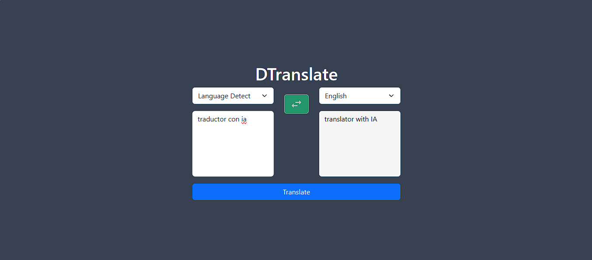
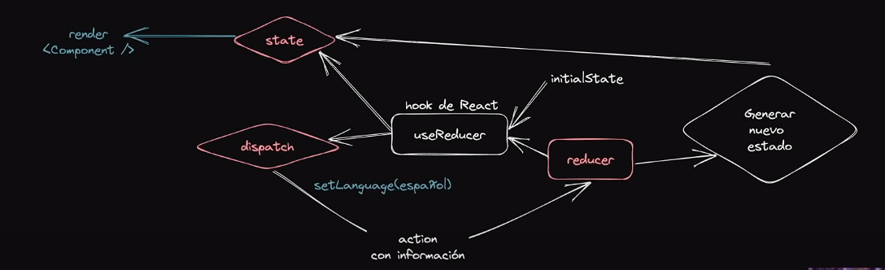

# Translator + Cohere IA + Yarn + React + TypeScript + Vite

Traductor que utiliza la API de Cohere IA para lograr traducciones sin necesidad de un diccionario. 



# Gestión del Estado con el hook useReducer

## ¿Que es useReducer?

 - Es un hook que permite manipular el estado de los componentes por medio de una función reducer. Y con la función de retorno dispatch se lograra actualizar el estado.



<p align="center">Imagen tomada en el curso de midudev</p>

# Instalación

1. Clonar repositorio

   ```git clone https://github.com/dtoro-dev/translator-cohere-ia.git```

2. Ir al directorio del proyecto e instalar dependencias

   ```yarn install```
   o
   ```npm install```

3. Debes agregar un archivo .env, con las variables descritas en el .env.examples

4. Ingresa a la pagina oficial de [Cohere IA](https://dashboard.cohere.com/welcome/login), regístrate y obtén una apiKey

5. Agrega tu apiKey en el .env

6. Con el siguiente comando inicias la aplicación

   ```yarn run dev``` o ```npm run dev```